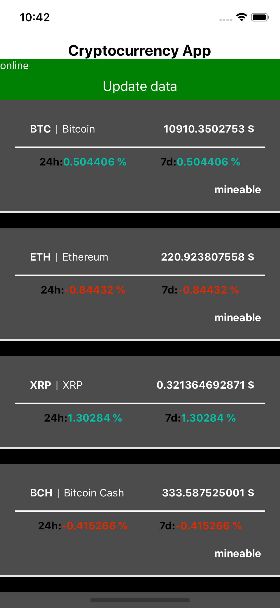
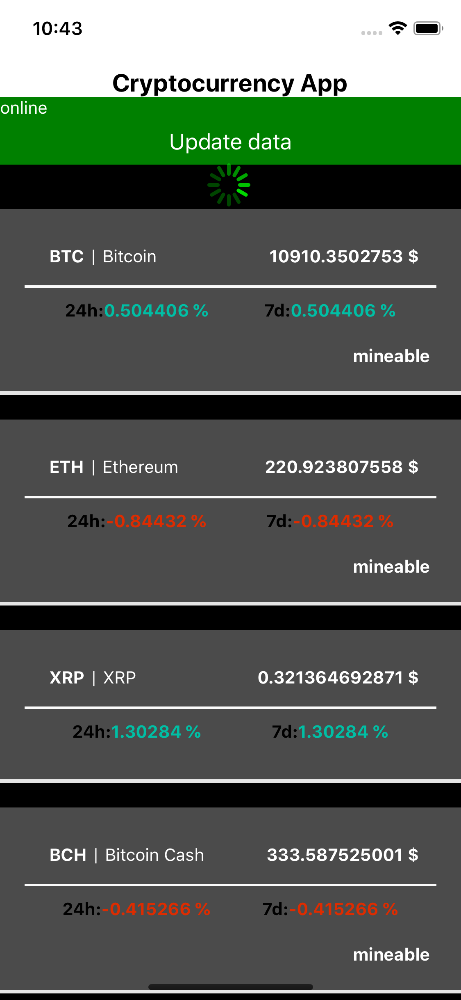
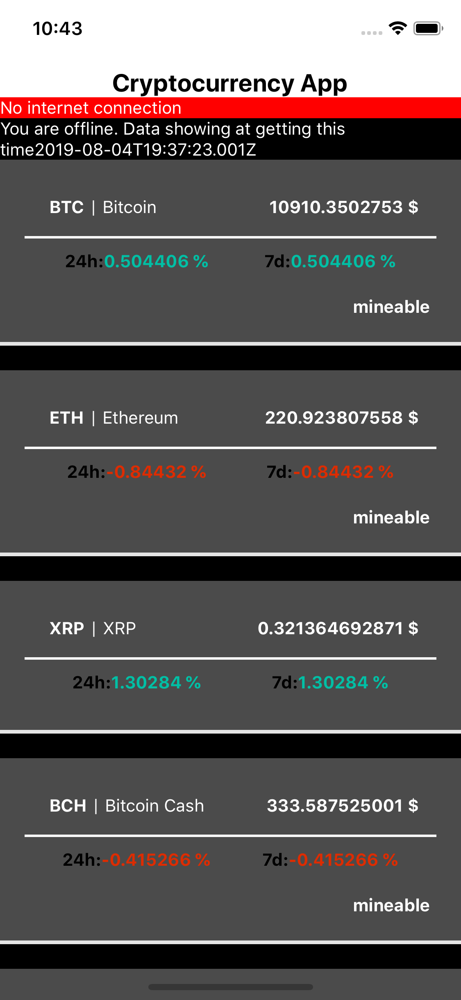

# CryptoListApp
Offline first cryptocurrency app&nbsp;
Redux using for state managment&nbsp;
Redux persist for offline viewing&nbsp;
Middleware, Redux thunk for asynchronous actions &nbsp;&nbsp;

Test with jest and enzyme:
  - Mocked fetch data and for using redux-mock-store to reach store function for actions testing.
  - CryptoReducer test for all action types
  - CoinCard component snapshot test
  
  ### Screenshot

